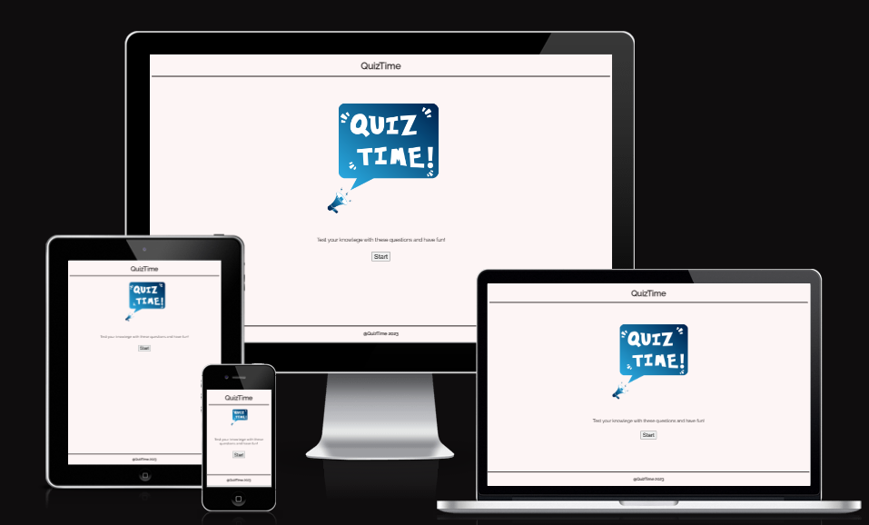
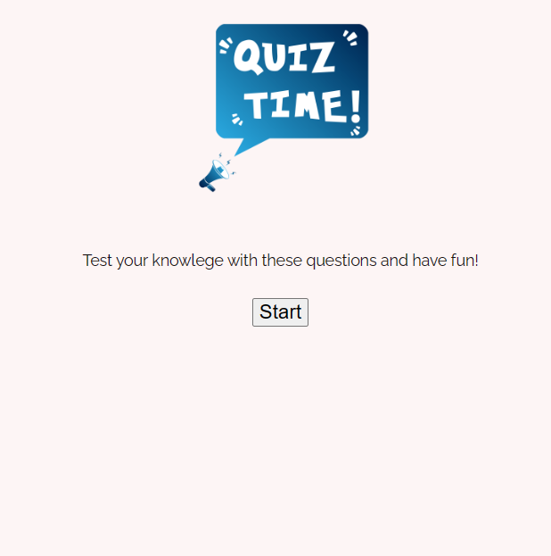
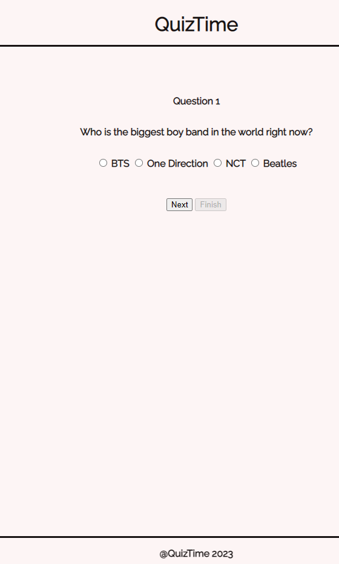
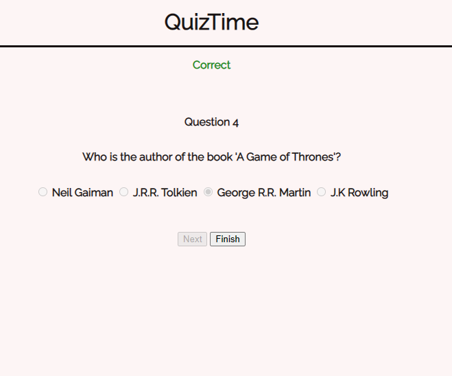
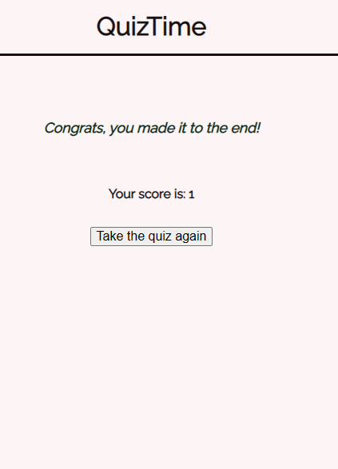
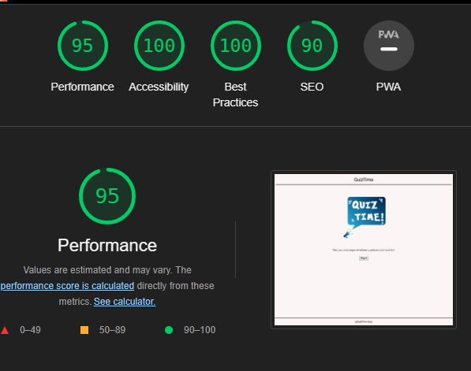

# *QuizTime*

QuizTime is a online quiz website. This site is designed for people who enjoy general knowlege questions.
The multiple-choice format allows users to select the best answer from a given set of options.
With a diverse set of questions, the website hopes to reach the ones who are experts and the ones that will broaden their knowlege.

## **Features** ##

### *Existing features* ###

#### **Header** ####

The header is simple and contains just the name of the page with a border.
The title of the page is centered.

#### **Start page** ####

* The start page contains a image of a megafon calling for QuizTime.
* It also has a sentance to encourage people to try the quiz.
* The start page has a "Start" Button that takes the users to the questions page.

#### **Questions page** ####

* The questions are multiple choice and there are 2 buttons.
* The "Finish" button is disabled until the last question. 
* On the last question the "Next" button is disabled and the "Finish" button is enabled. 

#### **Result page** ####

* Here you have a simple text with congrats you finished the game. 
* The score is also shown depending on how many questions the user has answerd correctly.
* The users have option to try again to play the game by clicking the " Take the quiz again" button.

#### **Footer** ####

The footer is simple with only containing the text QuizTime 2023. 

### *Future features* ###

* Impementing a sign up page where the users can store their score.
* Uppdating the library to include more questions.

## **Testing** ##

* The page was tested and works as expected in following browsers: Edge, Chrome, Safari, Firefox as well as diffrent devices: desktop, laptop, tablet and mobile.

## **Bugs** ##

No bugs found.

## **Code Validation** ##

#### HTML

* No errors were found when the code was tested in official W3C validator.

#### CSS

* No errors were found when the code was tested in official (Jigsaw) validator.

#### JavaScript

* No errors were found when the code was tested in official (JSHint) validator.

## **Accessibility** ##

The font-family and the colors that were chosen were tested in devtools Lighthouse. 

## **Deployment** ##

* The web page was deployed to GitHub pages using the following steps:
    - Navigate to GitHub repository, then Settings.
    - On the left side, inside the Settings menu click on the pages tab.
    - Go to build and deployment, and then choose source: Deploy from branch.
    - Under branch choose main for branch and root for folder. 
    - When you press on the save button, the site is being deployed.

The live link can be found here:<a href="https://jasminabihel.github.io/quiz-time/">QuizTime</a>

## **Credits** ##

* The image for the picture on the start page is taken from pngtree.com
<a href='https://pngtree.com/so/quiz'>quiz png from pngtree.com/</a>

* The code for the fixed footer was taekn from W3Schools. 

<a href="https://www.w3schools.com/howto/howto_css_fixed_footer.asp" > Fixed footer</a>